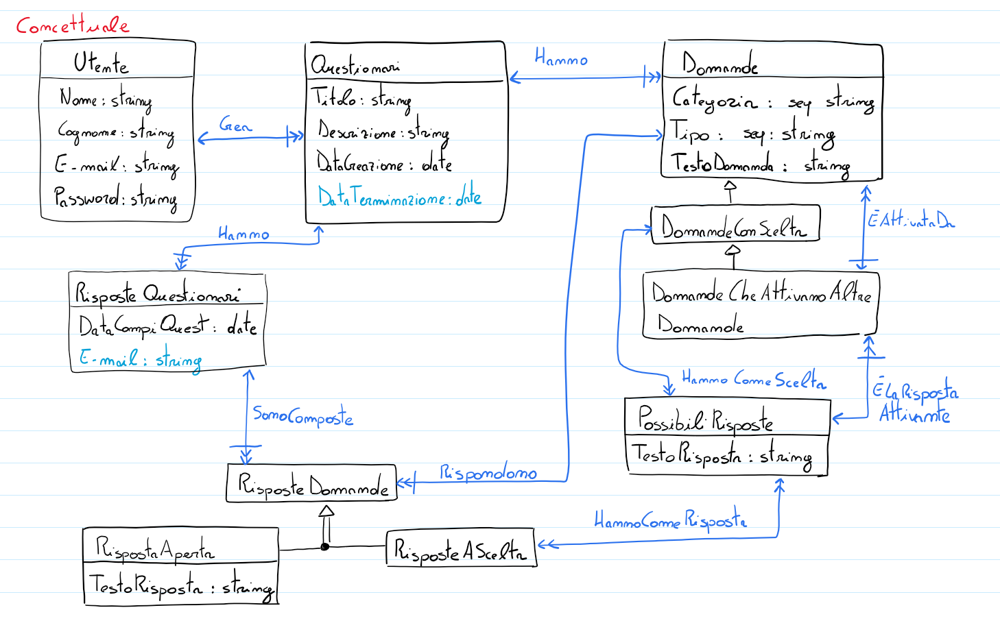
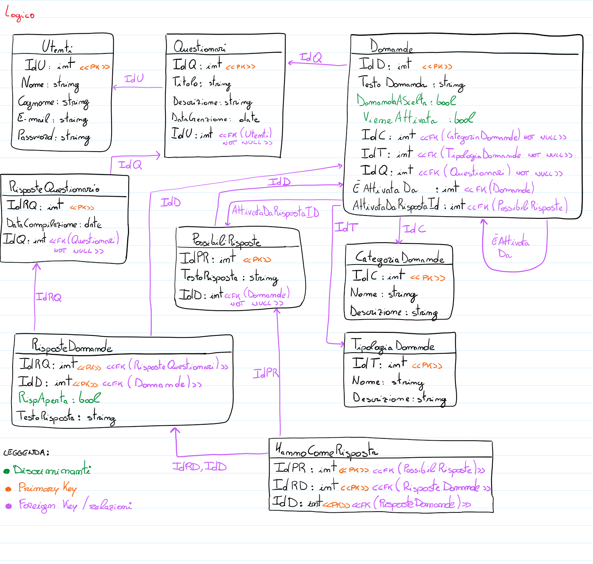
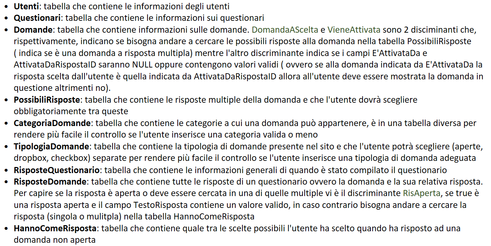

### Progetto per il corso di Basi di Dati 2020/2021

__Gruppo:__ _Math.Random_

Composto da
``Alessandro Zanin (870696)``, ``Matteo Spanio (877485)``, ``Michael Alessandro Montin (874449)``

### Indice

1. **Introduzione al progetto**
   1. Strumenti e piattaforme usate per sviluppare il progetto
      1. Librerie utilizzate
   2. Gestione del gruppo e suddivisione del lavoro
   3. Istruzioni per il setup dell'ambiente per eseguire il progetto in locale
2. **Database**
   1. Schema logico e relazionale della Base di Dati
      1. Implementazione delle relazioni
   2. Query sviluppate
   3. Transazioni, Rollback, Triggers - Politiche d'integrità del database
   4. Routes in Flask
   5. Implementazione delle funzioni di Login/Sign-in
   6. Analisi dei dati dei questionari
   7. Definizione di ruoli
4. **Misure di sicurezza**
   1. Hash e passwords
   2. Autenticazione e Log-in
   3. CSRF, SQL Injection
5. **Sviluppo grafico del sito**

### 1. Introduzione al progetto

Il progetto consiste nell'implementazione di una Web Application 
dedicata alla creazione di questionari. 
Ogni utente può creare innumerevoli questionari, ognuno formato da 
multiple domande che a loro volta possono essere di 
diversa categoria (risposta aperta, scelta singola, scelta multipla).
Ogni utente può inoltre vedere tutti i questionari fatti da altri utenti
e rispondere alle domande di ognuno di essi.
Il proprietario di un questionario sarà poi in grado di visionare le
risposte fornite dagli utenti ed esportarle in formato CSV.

### **i. Strumenti e piattaforme usate per sviluppare il progetto**

Il progetto è stato sviluppato utilizzando Python e SQLAlchemy,
tutti i membri del gruppo hanno usato l'IDE PyCharm per 
interfacciarsi con semplicità ed efficacia allo sviluppo del progetto.  
Il codice è stato condiviso tramite un repository
GitHub in modo che ognuno potesse lavorare sulla versione più recente
possibile, inoltre il database è stato condiviso tramite Heroku, che
ha permesso a tutti i membri di lanciare l'applicazione usando lo
stessa base di dati per la fase di testing e sviluppo.  
Il gruppo ha inoltre deciso di creare un gruppo Whatsapp dedicato al
progetto in cui tutti i membri erano sempre raggiungibili per 
eventuale necessità.  
Il gruppo ha fatto riferimento al libro di testo "_Flask Web Development_"
di Miguel Grinberg come ulteriore fonte di esempi e spiegazioni riguardanti
Flask e altre componenti del progetto.

Le principali librerie utilizzate per implementare le funzionalità della Web App sono per la maggior parte dei wrapper,
costruiti appositamente per flask, di altre librerie: in particolare flask_sqlalchemy, flask_login, flask_mail,
flask_pagedown sono le librerie con cui si gli sviluppatori che gli utenti
sono a più stretto contatto per l'interazione con l'applicazione.

- `flask-sqlalchemy` è un ulteriore livello di astrazione che si interpone tra flask e sqlalchemy
facilitando la gestione delle sessioni e connessioni al database, inoltre introduce una sintassi semplificata
delle query.
- `flask-login` si occupa di gestire le sessioni degli utenti e viene usato principalmente
per controllare l'accesso degli utenti registrati alle pagine.
- `flask-mail` è la libreria utilizzata per l'invio della mail di conferma per la registrazione
degli utenti
- `flask-pagedown` consente l'input dell'utente in sintassi markdown e viene utilizzata nella creazioen
dei questionari, rendendo possibile personalizzare il testo delle domande.

**ii. Gestione del gruppo e suddivisione del lavoro**

Il gruppo non ha ritenuto necessaria la definizione di ruoli precisi,
ci sono stati molteplici incontri online tramite piattaforme come Discord
in cui ogni membro ha avuto la possibilità di esprimere le sue idee
e opinioni, alla fine di ogni incontro ognuno si è autonomamente
assegnato gli incarichi che si trovava più a suo agio a svolgere,
nello specifico `Michael` ha preferito principalmente concentrarsi sulla
creazione di triggers e gestione della base di dati, `Matteo` ha deciso di
concentrare i suoi sforzi sullo sviluppo delle routes gestite da Python,
mentre `Alessandro` ha curato la veste grafica dell'applicazione e la documentazione. 
Nonostante questo, ogni sviluppo è stato ampiamente discusso e trattato
con tutti i membri del gruppo che hanno dato il loro contributo ogni 
qualvolta fosse richiesto.

### **iii. Istruzioni per il setup dell'ambiente per eseguire il progetto in locale**

Se ancora non si ha i file sorgente è necessario prima di tutto scaricarli da github con il comando
```shell
git clone https://github.com/matteospanio/Progetto-BD-2021.git
```

Scaricato il progetto si entri nella cartella principale con `mv Progetto-BD-2021`, una volta cambiata cartella di lavoro
è necessario installare un virtual environment con il comando `virtualenv venv` e per attivarlo basterà digitare
`source venv/bin/activate` (per maggiori dettagli sull'installazione di un virtual environment si rimanda alla
[documentazione ufficiale](https://packaging.python.org/guides/installing-using-pip-and-virtual-environments/#creating-a-virtual-environment).

A questo punto è necessario installare le librerie utilizzate dal progetto con il comando `pip install -r requirements.txt`.
Successivamente bisogna creare le variabili d'ambiente per flask:
```shell
# per sistemi Unix-like
export FLASK_APP = runner.py
export FLASK_ENV = development

# su windows
set FLASK_APP = runner.py
set FLASK_ENV = development
```

Fatto ciò, si può scegliere se usare il database già preconfigurato su Heroku o crearne uno locale.
Se si desidera creare un database locale si consiglia di utilizzare postgres tramite phppgadmin, per collegare il database
creato basterà digitare nella shell:
```shell
# su sistemi Unix-like
export DEV_DATABASE_URL = 'postgresql://<pg_username>:<pg_password>@localhost/<db_name>'
# dove:
# pg_username è il nome utente di postegres
# pg_password è la password di postgres
# db_name è il nome del database creato

# su windows
set DEV_DATABASE_URL = 'postgresql://<pg_username>:<pg_password>@localhost/<db_name>'
```
infine per creare le tabelle del database basterà digitare:
```shell
# per creare lo schema del database si usa create_tables
flask create_tables
# fill_qtypes_table riempie le tabelle con alcuni dati standard
flask fill_qtypes_table
```
A questo punto si può far partire l'applicazione con `flask run` e collegarsi all'indirizzo http://127.0.0.1:5000/.

Non è essenziale per il funzionamento dell'applicazione ma è possibile inserise dei dati fittizzi per 
osservare l'applicativo a pieno carico. Per generare i dati è stato utilizzato il modulo `faker`. Analogamente a quanto fatto prima
per popolare il database è sufficiente lanciare il comando `flask faker` per generare 100 nuovi utenti e 200 questionari
con relative domande.

Volento si può personalizzare la quantità di dati generati, ma sarà necessario interagire
tramite la shell:

da terminale digitate `flask shell` e si aprirà un ambiente interattivo da cui si può interagire con l'applicazione.
Da qui sarà sufficiente digitare:

```python
from app import fake
fake.users(x) # con x numero degli utenti da generare
fake.questionari(y) # con y numero di questionari generati
```

### 2. Database

### **i. Schema logico e relazionale della Base di Dati**

Per la Base di dati è stato sviluppato il seguente schema logico
e relazionale che illustra le relazioni e gli attributi delle varie 
tabelle

**Schema Concettuale:**


**Schema Logico:**


**Breve descrizione delle varie tabelle:**


### **i.a. Implementazione delle relazioni**

SQLAlchemy utilizza le relationships in modo da rendere le relazioni
percorribili anche nel verso opposto a quello prestabilito.
Un esempio di implementazione di relationships all'interno del nostro
progetto è il campo questions della classe Questionario, all'interno di 
questo campo definiamo come, in caso di delete, vengano eliminate a cascata
anche tutte le domande collegate a suddetto questionario:

```python
class Questionario(db.Model):
    __tablename__ = 'quizzes'
    id = db.Column(db.Integer, primary_key=True)
    uuid = db.Column(db.String, default=uuid4())
    timestamp = db.Column(db.DateTime, default=datetime.utcnow())
    title = db.Column(db.String(64))
    description = db.Column(db.Text)
    description_html = db.Column(db.Text)
    author_id = db.Column(db.Integer, db.ForeignKey('users.id'))
    questions = db.relationship('Domanda', cascade="all,delete", backref='in', lazy='dynamic')
```

### **ii. Query sviluppate**

Di seguito sono riportate alcune delle query che abbiamo sviluppato 
per il progetto:

si va dalle più standard (abbastanza ricorrenti) per elencare il contenuto delle tabelle:
```sql
SELECT quizzes.title AS quizzes_title,
       quizzes.description AS quizzes_description,
       quizzes.description_html AS quizzes_description_html,
       quizzes.timestamp AS quizzes_timestamp,
       quizzes.uuid AS quizzes_uuid, users.username AS users_username 
FROM users JOIN quizzes ON users.id = quizzes.author_id
```
che in orm si traduce più elegantemente come :
```python
db.session.query(
            Questionario.title, Questionario.description,
            Questionario.description_html,
            Questionario.timestamp,
            Questionario.uuid, User.username).\
        join(
            Questionario, User.id == Questionario.author_id)
```
**Semantica**: la query sopra riportata viene utilizzata per ottenere l'elenco di tutti i questionari creati
nel database unendo i campi della tabella `Questionario` con la tabella `User`. La `JOIN` avviene tramite
la chiave esterna.

Di seguito invece si riporta la query utilizzata per raccogliere tutte le informazioni sulle risposte dei questionari
che sono divise su più tabelle:
```sql
  SELECT questions.text AS "Domanda", questions.type_id AS "Tipo",
         questions.id AS "Id_domanda",
         CASE WHEN answers_to_questions.is_open
             THEN answers_to_questions.text
             ELSE possible_answers.text
             END AS "Risposta" 
  FROM questions JOIN answers_to_questions ON questions.id = answers_to_questions.question_id
      LEFT OUTER JOIN (have_as_answer AS have_as_answer_1 JOIN possible_answers
          ON possible_answers.id = have_as_answer_1.possible_answer_id)
          ON answers_to_questions.id = have_as_answer_1.answer_to_questions_id
                 AND answers_to_questions.question_id = have_as_answer_1.question_id 
  WHERE answers_to_questions.id IN (
      SELECT quiz_answers.id 
      FROM quiz_answers 
      WHERE quiz_answers.quiz_id = %(quiz_id_1)s)
      ORDER BY questions.id, answers_to_questions.id
```
che in python diventa:
```python
  subquery = db.session.query(
     RisposteQuestionario.id).\
     filter(RisposteQuestionario.quiz_id == quiz_id, RisposteQuestionario.id == i)

  db.session.query(
      Domanda.text.label('Domanda'),
      case((RispostaDomanda.is_open, RispostaDomanda.text),
          else_=PossibileRisposta.text).label('Risposta')).join(RispostaDomanda) \
              .outerjoin(RispostaDomanda.have_as_answers).filter(RispostaDomanda.id.in_(subquery)) \
              .order_by(Domanda.id, RispostaDomanda.id)
```
**Semantica**:
Dato un questionario e l'input fornito dall'utente, la query 
prende i testi delle domande e la relativa risposta.
Dal momento che la risposta può avere tipi diversi (come risposta aperta o 
a scelta multipla), la query fa una JOIN con la tabella delle possibili
risposte, utilizzando una relazione molti a molti, per prelevare il 
testo della risposta nel caso in cui la domanda sia a scelta.

### **iii. Transazioni, Rollback, Triggers - Politiche d'integrità del database**

I Rollback vengono usati come strato di protezione dei dati nel caso 
un operazione vada storta, riportando l'applicazione allo stato in cui era
prima dell'operazione stessa. Sono molto utili quando si cerca di 
aggiungere dati o informazioni che potrebbero venire corrotti o danneggiati,
in questi casi infatti è sufficiente impostare un Rollback che salvi 
l'integrità del database.

Ad esempio, nel momento in cui un operazione di `submit`
viene eseguita su una risposta ad un questionario, le informazioni da 
registrare vengono salvate su due tabelle diverse: Una conterrà tutte le
risposte del questionario, mentre l'altra prende la risposta singola e la
raggruppa alle altre risposte per la medesima domanda fornite da altri utenti.  
Queste due tabelle vengono poi utilizzate per le due differenti visualizzazioni
delle risposte dei questionari che si può vedere all'interno della 
Web App, ma ovviamente è possibile che questa operazione non vada a buon 
fine.  
Nel momento in cui il `commit` viene effettuato, se l'operazione è andata
a buon fine viene eseguito l'aggiornamento della sessione, nel caso 
in cui invece ci siano stati dei problemi che renderebbero quindi i dati
parziali viene effettuato un Rollback:
```python
  # di seguito viene usata la seguente notazione [···] per riferirsi a parti di codice
  # tralasciate perché superflue alla semantica del rollback
  if form.validate_on_submit():
          # sto registrando una risposta: aggiungo il record al db
          new_record = RisposteQuestionario(user_id=current_user.id, quiz_id=current_quiz.id)
          db.session.add(new_record) <--
          db.session.flush()         <--
      # [···]
      # dom.type_id è il tipo di domanda che è stata compilata nel form 1=aperta, 3=a scelta singola, 2=multipla
      if dom.type_id == 1:
          # [···]
          db.session.add(RispostaDomanda( <--
              id=new_record.id, question_id=dom.id, is_open=True, text=req)
          )
      elif dom.type_id == 3:
          risp = RispostaDomanda(id=new_record.id, question_id=dom.id, is_open=False)
          db.session.add(risp)          <--
          db.session.flush()            <--
          db.session.execute(statement) <--
      else:
          # [···]
          db.session.add(risp) <--
          db.session.flush()
          for elem in request.form.getlist('domanda' + str(iterator)):
              statement = have_as_answer.insert().values([···]) <--
                      db.session.execute(statement)             <--
                      db.session.flush()                        <--
          # alla fine dell'aggiunta di tutte le risposte si esegue un try per l'insert
          try:
              db.session.commit()   <--
              flash('Risposta inviata', 'success')
          except IntegrityError:
              # oppure si annulla tutto con un rollback
              flash('Si è verificato un errore nella registrazione della risposta', 'warning')
              db.session.rollback() <--
```
Questo secondo Rollback, invece, viene usato nel processo di creazione
di utenti fittizi per riempire il database con dati di prova.  
Siccome questi dati sono creati in maniera casuale e potrebbero presentare
errori, il Rollback garantisce che il progetto verrebbe riportato 
ad uno stato funzionante:
```python
while i < count:
    u = User(fake_datas)
    db.session.add(u)
    try:
        db.session.commit()
        i += 1
    except IntegrityError:
        db.session.rollback()
```

### **iv. Routes in Flask**

Il Progetto si divide essenzialmente in 3 grandi sezioni: 
Autenticazione, interfaccia
del sito e infine modifica e renderizzazione dei questionari.  
Per ognuna di queste sezioni, chiamate Blueprint, troviamo
un file `__init__.py` che funge da inizializzazione,
nel secondo file invece (`forms.py` oppure `errors.py`) troviamo 
utilità come la definizione di classi di dati che le pagine
gestiranno, metodi/funzioni oppure pagine di errore comuni.  
Infine, nel file `views.py` troviamo le effettive Routes
che stabiliscono quando e come ciascuna pagina deve
essere visualizzata (per esempio, potremmo voler avere
pagine accessibili solo dopo una 
POST come ad esempio `'/delete/<quiz_id>'`)

### **v. Implementazione delle funzioni di Login/Sign-in**

Le funzionalità di Login e Sign-In sono trattate più
nel dettaglio nella sezione 3.ii di questo documento, 
tutte le funzionalità ricollegabili a questa categoria
sono contenute nella Blueprint auth.
Particolare attenzione è stata fatta all'utilizzo di username 
al posto di id per ottenere uno strato di sicurezza aggiuntiva
del server, evitando quindi che un utente malintenzionato
possa trovare gli id degli utenti quando non dovrebbe 
essere in grado di farlo.

### **vi. Definizione di ruoli**

I ruoli sono una funzionalità senza dubbio molto efficiente, 
permettono di conferire un gruppo di permessi senza 
doverli impostare manualmente alla creazione di ciascun utente.
Semplicemente, impostando di quali permessi può
godere ogni tipologia di ruolo, basta poi assegnare
quello appropriato nella fase di registrazione.
Nonostante la loro utilità, abbiamo deciso di non utilizzarli per due
ragioni, ciascuna causa e conseguenza dell'altra: 

1) Durante i nostri incontri iniziali per ragionare sulla
struttura del progetto ci siamo resi conto che, sostanzialmente,
i ruoli a noi non sarebbero serviti. Abbiamo strutturato il
sito in modo che gli utenti siano tutti allo stesso livello
per quanto riguarda i permessi (tutti gli utenti possono 
eseguire tutte le operazioni, dalla creazione di nuovi
questionari alla visione e compilazione di quelli altrui).  
Sarebbe stato quindi ridondante creare un singolo ruolo
che non avrebbe nemmeno rappresentato una restrizione di alcun tipo.
2) Heroku, la piattaforma che abbiamo deciso di utilizzare
per lo sviluppo del progetto, non supporta i ruoli come 
funzionalità.  
Anche volendo, quindi non avremmo comunque potuto 
implementarli ma, come illustrato nel punto 1), 
non avendone bisogno non abbiamo sentito la mancanza
di questa funzionalità.

Nonostante tutto, abbiamo comunque deciso di implementare una sorta di 
clone dei ruoli, ovvero abbiamo creato all'interno del database
una tabella chiamata, per l'appunto, ruoli, che 
ne emula le funzionalità e i vantaggi.

## 3. Misure di sicurezza

### **i. Hash e passwords**

All'interno del file `models.py` abbiamo creato una
moltitudine di funzioni che ci hanno permesso di gestire
le password e la loro memorizzazione all'interno del database.  
Ogni password viene protetta tramite una funzione hash che
la rende illeggibile agli occhi di malintenzionati, inoltre
abbiamo fatto attenzione che la stessa password salvata 
più volte non riproducesse lo stesso hash proprio per evitare
che multipli utenti che utilizzano la stessa password
potessero rappresentare una debolezza nella sicurezza della
base di dati.

Per ragioni di sicurezza, la password non è direttamente 
accessibile, quindi la lettura e l'impostazione sono fatte
tramite hash.

Di seguito viene riportato il codice responsabile della gestione
della password: 

```python
 @property
 def password(self):
     raise AttributeError('password is not a readable attribute')

 @password.setter
 def password(self, password):
     self.password_hash = generate_password_hash(password)

 def verify_password(self, password):
     return check_password_hash(self.password_hash, password)

 def generate_confirmation_token(self, expiration=3600):
     s = Serializer(current_app.config['SECRET_KEY'], expiration)
     return s.dumps({'confirm': self.id}).decode('utf-8')
```

### **ii. Autenticazione e Log-in**

Come anticipato nella sezione 2.v del documento, tutto ciò che
riguarda la sicurezza del sito e della base di dati è sviluppato
all'interno della blueprint `auth`.  
Particolare attenzione è stata fatta all'utilizzo di username 
al posto di id nella gestione delle password 
per ottenere uno strato di sicurezza aggiuntiva
del server, evitando quindi che un utente malintenzionato
possa trovare gli id degli utenti quando non dovrebbe 
essere in grado di farlo tramite un utilizzo malizioso ed improprio
delle query.

Il progetto salva e mantiene delle informazioni, i Cookies.
Grazie a questi piccoli salvataggi siamo in grado di creare
un esperienza più conveniente per l'utente che, ad esempio, 
nel caso in cui abbia effettuato l'accesso in una 
sessione precedente e abbia chiuso il sito senza effettuare il 
Log-Out, noterà di essere ancora collegato alla riapertura del
sito, senza avere il bisogno di reinserire le informazioni del suo 
profilo. I Cookies, situati nella cartella `flask_session`,
durano circa un anno, dopo tale periodo decadono e 
vengono eliminati.

### **iii. CSRF, SQLInjection**

La gestione delle SQLInjection, ovvero quando un utente 
malintenzionato "inietta" codice SQL per estrapolare dati in posti e modi che
non dovrebbero essergli permessi, è gestita quasi totalmente
in autonomia da SQLalchemy.orm, tanto che i controlli predisposti sono più 
atti alla prevenzione di errori umani.

Per quanto riguarda CSRF (Cross-Site Request Forgery), una vulnerabilità 
che occorre quando un sito malizioso manda richieste 
al server dell'applicazione in cui l'utente è attualmente connesso,
Flask-WTF necessita di una chiave segreta per essere configurato,
grazie ad essa infatti l'estensione è in grado di proteggere tutti 
i forms da attacchi CSRF, grazie ad essa viene generato un token di 
sicurezza salvato all'interno della sessione utente, a sua volta 
protetta da una firma crittografica generata sempre dalla chiave segreta.

Esempio di implementazione di queste protezioni:
```html
<form method="POST">    
   {{ editor_form.hidden_tag() }}
   <h3>{{ editor_form.title(class='form-input') }}</h3>
   {{ editor_form.description(class='form-control') }}
   {{ editor_form.submit(class="btn btn-info") }}
</form>
```
In questo snippet di codice, il form `hidden_tag` genera un token 
che viene inviato insieme al resto dei dati e verifica che la 
richiesta http sia autentica.

Alcune vulnerabilità potrebbero nascere dalle librerie utilizzate che 
potrebbero fornire da sorgente per exploit di diversa natura, tuttavia
tutte le librerie utilizzate nel progetto sono Open-Source, ovvero 
sono pubbliche ed eventuali errori potrebbero essere rapidamente 
risolti dalla community online.

## 4. Sviluppo grafico del sito

La veste grafica della Web Application è stata inizialmente prototipata
su Bootstrap Studio per poi essere esportata direttamente su 
PyCharm, da qui sono state create le varie schermate dell'interfaccia
tramite HTML e CSS.
All'interno della cartella `Templates` si possono trovare tutti i file HTML
che modificano la veste grafica del sito, suddivisi in sottocartelle in base
alla loro sezione di appartenenza (nella cartella `auth` troviamo
tutti i templates collegati alle pagine di accesso e registrazione, nella
cartella `main` quelle che definiscono l'interfaccia complessiva ed infine nella
cartella `quiz` sono situate tutti gli editor e affini dei quiz).

L'applicazione si suddivide in multiple sezioni:
1) **Pagina iniziale**: Questa è la pagina che viene aperta all'avvio della
web application, il suo unico scopo è di accogliere l'utente o spingerlo
ad accedere/registrarsi, nel caso non lo avesse ancora fatto.  
La web app mantiene l'accesso di un utente (anche se chiude il sito
e lo riapre in seguito) tramite l'utilizzo
di cookies, per la durata di un anno.  
Una volta eseguito l'accesso al sito, l'utente avrà accesso a tutte
le sezioni del sito rimanenti.


2) **"Crea un questionario"**: Cliccando su questo link si verrà indirizzati
ad una pagina dove l'utente avrà accesso ad un pulsante per creare 
nuovi quiz (il pulsante aprirà l'editor che permetterà l'inserimento
di un titolo ed una descrizione, in seguito al salvataggio l'utente
potrà continuare la creazione inserendo tutte le domande che vorrà).  
L'utente, inoltre, ha a disposizione una lista di tutti i questionari
che ha già creato, con la possibilità di cancellarli, modificarli oppure
vederne le risposte.


3) **"Compila un questionario"**: Su questa schermata sono visibili i 
questionari creati da altri utenti in modo da poterli compilare.  
All'utente viene presentata una lista che mostra titolo, descrizione, data
di creazione e autore di ciascun questionario.  
Cliccando sul nome del quiz si verrà portati alla schermata di
inserimento delle risposte, mentre cliccare sul nome dell'autore mostrerà
il suo profilo e le informazioni ad esso collegate (ad esempio l'E-Mail).  
La tabella presenta molte funzionalità attue a migliorare l'esperienza 
utente quali pulsanti per riordinare la lista in ordine crescente/decrescente
in base ad una delle categorie (Ad esempio ordinarle per ordine crescente
dei titoli) ed una barra di ricerca per scremare i risultati proposti.  

   Ci sono 4 tipologie di domande supportate dal sito:
   - Aperta, ovvero un campo di testo in cui l'utente è libero di
   scrivere tutto ciò che vuole;
   - Scelta, dove l'utente deve selezionare una singola risposta tra quelle
   fornite.
   - Multi-scelta, molto simile a Scelta, qui l'utente può selezionare
   multiple risposte invece di una sola;
   - Attivabili, non un vero tipo di domanda ma più una funzionalità delle 
   domande a Scelta, permettono di creare quesiti che vengono proposti
   all'utente solo se viene selezionata una determinata risposta nella 
   domanda a Scelta a cui sono collegate. 
   

4) **"Risposte ai tuoi questionari"**: Da qui, è possibile accedere
direttamente alle risposte fornite dagli utenti sui propri questionari.  
Una volta selezionato lo specifico quiz di cui si vogliono visionare i
risultati si avrà la possibilità di visualizzare i risultati 
in due diversi modi:
   - Per domanda: 
   Ogni domanda è separata e presenta una lista delle sue risposte;
   - Per compilazione: 
   Mostra tutte la lista di risposte di ogni utente in ordine.

   La prima visualizzazione è molto utile se vogliamo vedere le varie
   risposte per una specifica domanda, mentre la seconda diventa fondamentale
nei questionari dove le domande sono collegate tra di loro e diamo più
importanza a tutte le risposte prese collettivamente invece che singolarmente.  
   Come specificato in precedenza, anche nella schermata
   "Crea un questionario" è presente un pulsante "Visualizza risposte" 
   che porterà alla medesima schermata di visualizzazione delle risposte
   del questionario selezionato.


5) **"Profilo"**: Quest'ultima pagina presenta informazioni sul profilo
dell'utente (il nome utente, la E-Mail collegata all'account, l'ultimo 
accesso effettuato e il numero di questionari creati).
La schermata presenta anche un pulsante "Modifica Profilo" che riporta
a delle impostazioni per l'account, come la possibilità di modificare 
la propria E-Mail oppure il Nome Utente.