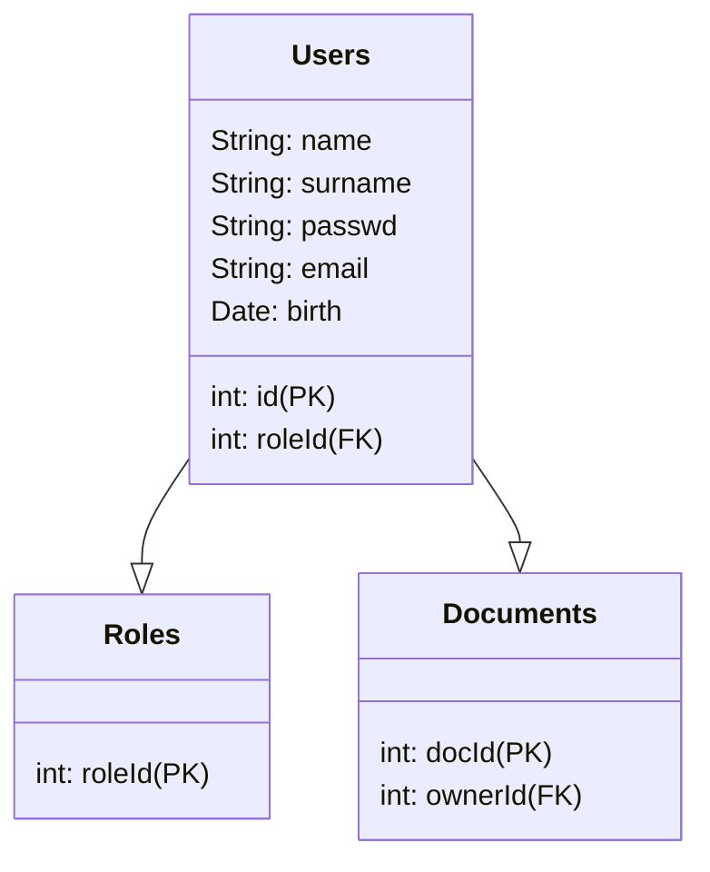

Home page che chiede per login/signin

Una volta effettuato l'accesso c'è un archivio con i miei questionari e la possibilità di farne di nuovi

Su quelli archiviati voglio vedere le statistiche e chi ha risposto cosa/quando

Su quelli nuovi voglio:

- poter aggiungere domande
  
  - a scelta multipla
  
  - a risposta libera
  
  - a scelta singola

- poter condividere con gli altri utenti dell'app (ci limitiamo solo alla condivisione tra utenti registrati?)

Funzionalità:

- fare in modo che ci sia una spunta per i questionari 'archiviati', quindi solo consultabili e non più compilabili

Database su Heroku:

